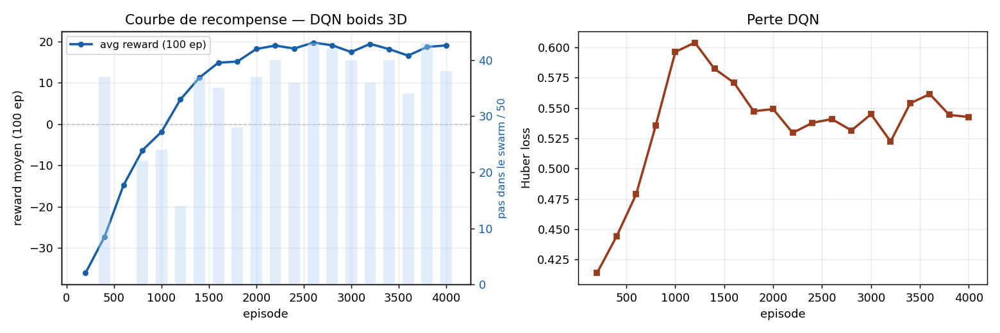

# Boid RL Agent; 3D swarm following with DQN

Un agent RL (Double DQN) apprend à suivre un swarm de boids en 3D.

## Structure

```
boid_rl_agent/
├── src/
│   ├── sim.py      — physique boids 3D (séparation, alignement, cohésion, Euler)
│   ├── env.py      — environnement RL (obs 12D, 27 actions, épisodes 50 pas)
│   └── agent.py    — Double DQN avec replay buffer et target network
├── scripts/
│   ├── train.py    — boucle d'entraînement
│   └── viz.py      — visualisation 3D matplotlib
├── models/
│   ├── dqn_best.pt — meilleure politique sauvegardée
│   └── dqn.pt      — dernière politique sauvegardée
├── outputs/
│   └── training_curves.png
└── requirements.txt
```

## Quickstart

```bash
pip install -r requirements.txt

# entraîner
python scripts/train.py --episodes 4000 --boids 15

# reprendre un entraînement
python scripts/train.py --resume models/dqn_best.pt --episodes 2000

# visualiser la politique apprise
python scripts/viz.py --policy models/dqn_best.pt --episodes 3

# sauvegarder les épisodes en gif
python scripts/viz.py --policy models/dqn_best.pt --episodes 3 --save
```

## Environnement

| Paramètre | Valeur |
|-----------|--------|
| Durée épisode | 50 pas |
| Boids | max 20 |
| Boîte | 20×20×20 (bornée, rebond) |
| Observation | 12 floats : pos relative centroïde, vitesse agent, vitesse moy swarm, boid le plus proche |
| Actions | 27 discrètes : `{-1, 0, +1}³` sur l'accélération |
| Reward | −dist_normalisée + 0.4×alignement + 0.5×bonus_dans_nuage − pénalité_mur |

## Agent DQN

- Architecture MLP : de 12  à 128 puis 128 à 27
- Replay buffer : 30 000 transitions
- Target network synchronisé toutes les 200 steps
- ε-greedy décroissant linéairement sur `eps_decay` épisodes
- Optimiseur Adam, Huber loss, gradient clipping

## Résultats

Après 4 000 épisodes :

| Métrique | Valeur |
|----------|--------|
| Reward moyen (100 ep) | environ 19 |
| Pas dans le swarm / 50 | environ 40 |


